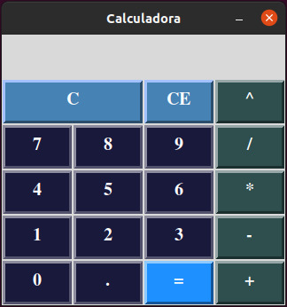

<h1> Primeira Prova de Python </h1>
<h3> Engenharia Elétrica com Ênfase em Sistemas e Computação</h3>
<h4> Algoritmos </h4>

  

<pre>
    Calculadora desenvolvida em Python para realizar operações básicas 
</pre>
